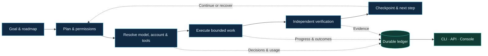

<h1 align="center">Agent Control Plane</h1>

<p align="center">
  <strong>Your agents. Your subscriptions. Your choice.</strong><br>
  One place to coordinate AI work — without building your workflow around one vendor.
</p>

<p align="center">
  <a href="#the-vision">Overview</a> ·
  <a href="#subscriptions-first">Subscriptions</a> ·
  <a href="#what-you-can-build">Use cases</a> ·
  <a href="#choose-the-capability-not-the-vendor">Integrations</a> ·
  <a href="#how-work-moves-forward">How it works</a> ·
  <a href="#explore-the-project">Explore</a>
</p>

> **The destination, not a release announcement.** This README presents the product
> we are building. It is not a claim that every integration or guarantee ships today.
> The canonical [implementation record](docs/ROADMAP.md) tracks delivery and verification;
> the [product specification](docs/audit/README.md) defines the target.

<sub>01 / THE VISION</sub>

## The vision

### Models change. Your operating model should not have to.

AI tooling evolves quickly. The underlying needs are more durable: give agents useful
instructions, choose the right resources, preserve context, control spending, verify
results and recover when something stops.

**Agent Control Plane is a local-first, extensible framework for those needs.**
It is designed to coordinate providers, models, accounts and tools through shared
contracts — so adopting a better implementation does not mean rebuilding your workflow.

- **For developers:** delegate implementation, research and review without manually supervising every terminal.
- **For teams:** keep initiatives, responsibilities, permissions and evidence organized.
- **For operators:** understand consumption, capacity and progress before deciding what runs next.

**The ambition is not to bundle every framework. It is to make the useful ones replaceable.**

---

<sub>02 / CAPACITY, NOT JUST API BILLS</sub>

## Subscriptions first

### Use the capacity you already pay for.

Our primary use case is coordinating coding-agent subscriptions, including Claude Code,
Codex and Kimi. Subscription CLIs, API-key clients and local models belong behind the
**same execution contract**, while retaining their actual authentication, capabilities
and usage limits.

| What you need to know | What the control plane is designed to do |
|---|---|
| Which account can handle the next task? | Combine observed usage, remaining quota, reset windows and reserved capacity |
| Which model should implement or review? | Resolve roles through configurable, versioned policies — not permanent brand rankings |
| What happens when capacity runs out? | Checkpoint safely, wait for renewal or select another authorized account/model |
| What did this initiative consume? | Attribute reported tokens and API costs; distinguish measurements, estimates and unknowns |
| Can I use an API or local model instead? | Select a compatible transport without rewriting the task or silently changing its budget |

A subscription is **not** an API key or unlimited capacity. Each adapter uses the
provider's permitted interface; login may require the operator. Switching must respect
provider terms and authorized budgets — never bypass limits or silently fall back to
paid API usage. Missing quota information stays **unknown**, not “100% available.”

---

<sub>03 / PRACTICAL OUTCOMES</sub>

## What you can build

| Use case | The intended experience |
|---|---|
| Ship a feature with an AI team | A coordinator plans, an implementer changes code, and an independent reviewer checks the result |
| Run several initiatives | Separate roadmaps, context, task graphs and evidence; parallel work only where resources and write ownership allow it |
| Continue after interruption | Resume from a validated checkpoint after a restart, quota pause or compatible account/model change |
| Improve model selection | Use measured outcomes and evaluations to revise routing policies without changing application code |
| Understand an execution | Inspect progress, decisions, usage and failures through CLI, API or an operator console |
| Adopt better tooling | Replace a compatible adapter while preserving task identity, permissions and recorded history |

The operator console is a product surface, not the execution engine.
Its full redesign follows backend certification.

---

<sub>04 / OPEN BY DESIGN</sub>

## Choose the capability, not the vendor

**These are design choices, not a supported-integrations checklist.** The initial
direction builds on existing components; alternatives require adapters and conformance
tests before becoming selectable.

| Need | Initial direction | Extension options |
|---|---|---|
| Model execution | Claude Code, Codex and Kimi subscription adapters | API-key providers and local/self-hosted models |
| Durable execution | SQLite supervisor and Restate driver | Temporal or another compatible engine |
| Agent reasoning and workflows | Native harness and policy-driven coordination | LangGraph; LangChain components inside bounded adapters |
| Tools and agent communication | Local tools, MCP over stdio/loopback; durable messaging | A2A for external-agent interoperability |
| Context and retrieval | Scoped artifacts and local context | LlamaIndex, vector stores or other retrieval adapters |
| Tracing and diagnostics | OpenTelemetry/OpenInference contracts; optional Phoenix | Another compatible telemetry backend |
| Evaluation | Native evidence pipeline; Promptfoo as external tooling | Other evaluation runners under the same result contract |
| Persistence and credentials | SQLite ledger, local artifacts and protected credential references | Transactional stores, object storage and keychain adapters |
| Voice and richer interaction | Text first | Optional speech, realtime and multimodal providers |

See the [full market comparison](docs/audit/architecture/integrations/market/index.md)
and [integration contracts](docs/audit/architecture/integrations/index.md).

### Interchangeable does not mean interchangeable at any cost.

The target composition policy checks compatibility **before work starts**.
One component owns each responsibility within its scope: two engines must not both
retry the same effect, and an SDK must not secretly override account or budget policy.

Restate could own durability while a bounded LangGraph harness handles a subtask —
but only with an explicitly tested division of responsibilities. An observability
backend observes; its failure must not control execution.

**Selection, checkpoint-based continuation and live migration are different capabilities.**
A replacement must satisfy the required contract and evidence profile. Unsupported
combinations are rejected with an explanation, not disguised as seamless switching.

---

<sub>05 / FROM INTENT TO EVIDENCE</sub>

## How work moves forward



**Shared contracts, replaceable edges.** Domain rules own task state, permissions and
budgets. Adapters translate provider protocols; vendor SDK types stay outside shared
contracts. A durable, append-only ledger anchors history and rebuildable views.

**Evidence before completion.** The design requires bounded write ownership,
independent verification and recovery that acknowledges uncertain external effects
instead of blindly repeating them. Credentials stay outside recorded history.

### Engineering foundation

| Layer | Technology in this repository |
|---|---|
| Core | TypeScript, Node.js, pnpm workspaces, Zod |
| Persistence | SQLite with WAL, via better-sqlite3 |
| Execution edge | Restate TypeScript SDK and a pinned external server |
| Local API | Fastify |
| Console foundation | React, Vite, TanStack Query, Radix, XYFlow |
| Verification | Vitest, ESLint, TypeScript checks, axe-core, GitHub Actions |

These are implementation choices, not a promise that every dependency can be hot-swapped.
Replaceability is established at deliberate boundaries and proved per adapter.

---

<sub>06 / LOOK UNDER THE HOOD</sub>

## Explore the project

| Start here | What you will find |
|---|---|
| [Product blueprint](docs/audit/README.md) | Use cases, requirements and the planned architecture |
| [Architecture](docs/audit/architecture/index.md) · [Data model](docs/audit/architecture/database/index.md) | Responsibilities, dependency direction and persistence contracts |
| [Composition rules](docs/audit/architecture/integrations/composition/index.md) | How integrations coexist without duplicate authority |
| [Quality and testing](docs/audit/quality/testing/index.md) | Behavioral tests, recovery drills and compatibility evidence |
| [Developer runbook](docs/operations/runbook.md) · [API reference](docs/api-reference.md) | Build, run and inspect the current implementation |
| [Contributing](CONTRIBUTING.md) · [Security](SECURITY.md) | Change discipline and operational boundaries |

<details>
<summary><strong>Developer setup</strong></summary>

Requires Node.js 22.17.0 and pnpm 10.26.2.

```sh
pnpm install
git config core.hooksPath .githooks
```

For the full local verification suite, acquire the pinned Restate server explicitly:

```sh
node scripts/acquire-restate-server.mjs
pnpm check
```

The current server pin supports macOS on Apple Silicon. Other platforms cannot run
every drill; consult the [runbook](docs/operations/runbook.md) and
[CI workflow](.github/workflows/ci.yml) for their coverage and prerequisites.
No provider subscription or API call is required for the scripted test fixtures.

The current surfaces are local-only and have **no product cutover authority**.
Production adoption and any wider exposure require separate validation and authorization.
Account configuration belongs outside repositories at
`~/.rottay-agent-control-plane/accounts.local.json` (mode `0600`); recorded history
carries credential references, not secrets. See the [security policy](SECURITY.md).

</details>

<p align="center">
  <strong>Build around the work. Keep the freedom to change the tools.</strong><br>
  Built at <a href="https://github.com/rottay">Rottay</a> · <a href="LICENSE">License</a>
</p>
