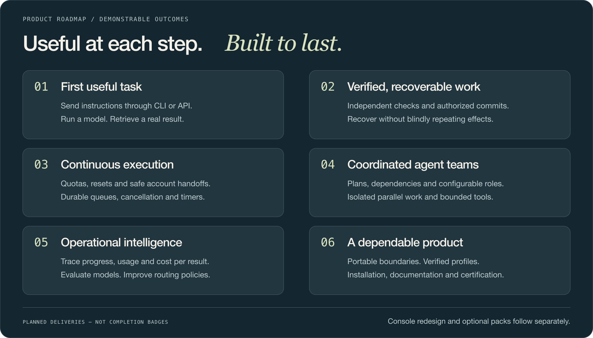

<h1 align="center">
  
</h1>

<p align="center">
  <a href="#overview">Overview</a> ·
  <a href="#what-you-can-build">Use cases</a> ·
  <a href="#subscriptions-as-a-first-class-resource">Subscriptions</a> ·
  <a href="#an-open-framework-not-a-fixed-stack">Integrations</a> ·
  <a href="#the-product-roadmap">Roadmap</a> ·
  <a href="#built-for-developers">Architecture</a> ·
  <a href="#explore-the-project">Explore</a>
</p>

> **The destination, not a release announcement.** This is the product vision.
> The canonical [implementation record](docs/ROADMAP.md) tracks what is delivered;
> the [specification](docs/audit/README.md) defines the requirements and acceptance tests.

<sub>01 / THE VISION</sub>

## Overview

### Your next model should be a choice. Not a rewrite.

**Agent Control Plane is a local-first, extensible framework for running AI work
across providers, models, accounts and tools.** It connects the whole journey:
a goal, an executable plan, an agent team, controlled execution, independent
verification and a record you can trust.

The starting point is practical: we work with coding-agent subscriptions and want
to coordinate their strengths and capacity without manually supervising every
terminal. The destination is broader: **one operating model for agent work,
with replaceable technology behind it.**


Models and frameworks will keep changing. The needs remain recognizable:
plan, delegate, execute, remember, verify, recover and measure. Those needs own
the contracts; vendor-specific protocols belong behind adapters.

**A coordinator today, a different reviewer tomorrow.** Assignments are versioned
policy decisions, not permanent rankings of Claude, Codex, Kimi or any next provider.

---

<sub>02 / THE POSSIBILITIES</sub>

## What you can build

### From a single task to an accountable agent team.

| When you want to… | The intended workflow |
|---|---|
| **Ship a feature from a brief** | Decompose the goal, assign implementation and independent review, run checks, and create an authorized commit |
| **Audit or refactor a codebase** | Explore read-only, collect evidence, propose bounded changes, and verify the result against the original objective |
| **Run several initiatives** | Keep roadmaps, context and results separate while sharing account capacity; parallelize only compatible work |
| **Continue a long-running project** | Survive quota pauses, restarts and compatible agent handoffs without reconstructing everything from a transcript |
| **Stay in control without babysitting** | Review proposed plans, simulate before execution, approve sensitive actions, and pause or cancel through durable controls |
| **Choose models by results** | Compare quality, latency and total cost per accepted result — including retries and reviews — then revise routing policy |
| **Understand what happened** | Follow instructions, decisions, tool calls, outcomes and verification through a correlated execution history |

The same operation should mean the same thing through **CLI, API and the future
operator console**. The interface changes; the authority, task and result do not.

---

<sub>03 / THE SUBSCRIPTION ADVANTAGE</sub>

## Subscriptions as a first-class resource

### Coordinate the capacity you already pay for.

Subscription CLIs, API-key clients and local models share an execution contract,
**not a billing model**. The control plane is designed to consider suitability,
reported usage, remaining quota, reservations and reset windows before dispatching work.


- **Route deliberately.** Choose a role, model and authorized account using configurable policies and the evidence available.
- **Continue safely.** Wait for renewal or rehydrate a verified checkpoint on a compatible destination; a change of account is not a fresh, unrelated task.
- **Account honestly.** Separate measured, estimated and unknown usage, subscription allocation and API spend. Track cost per result and forecasts with uncertainty.

Each provider's permitted interface and terms still apply; login may require the
operator. A subscription is not an API key or unlimited capacity. There is no
silent switch from exhausted subscription capacity to a paid API bill.

---

<sub>04 / CAPABILITIES WITHOUT LOCK-IN</sub>

## An open framework, not a fixed stack

### Choose the responsibility. Then choose its implementation.


The table below describes **integration directions and extension points**, not
a claim that every named option is installed or supported today.

| The need | Initial direction | Additional choices the architecture is designed to admit |
|---|---|---|
| **Execute a model** | Claude Code, Codex and Kimi subscription adapters | API-key clients and local/self-hosted models |
| **Coordinate durable work** | SQLite supervisor and Restate driver | Temporal or another driver with a proven compatibility profile |
| **Run agent workflows** | Native harness and configurable planning | LangGraph; LangChain components inside bounded adapters |
| **Use tools and delegate** | Local tools, MCP over stdio/loopback, durable messages | A2A and external-agent adapters |
| **Provide context and memory** | Scoped artifacts and local context | Retrieval adapters, LlamaIndex and vector stores |
| **Observe and evaluate** | Neutral OTLP/OpenInference contracts; optional Phoenix; external Promptfoo tooling | Compatible telemetry backends and evaluation runners |
| **Store and protect state** | SQLite, local artifacts and protected credential references | Transactional databases, object storage and keychain adapters |
| **Add richer interaction** | Text first | Optional speech, realtime and multimodal packs |

**Composition matters as much as selection.** One engine owns recovery for a run;
a delegated harness owns only its bounded subtask. A tool cannot expand permissions.
An observability backend must not become a dependency for completing work.

The planned preflight explains incompatible combinations before execution — including
overlapping retries, hidden model fallbacks and competing state owners.

> **Change the tools. Preserve the meaning of the work.**
>
> Selection, checkpoint continuation and live migration are different capabilities.
> Interchangeability requires real adapters passing the same contractual tests.
> It is never inferred from two libraries exposing similar interfaces.

[Explore the market comparison →](docs/audit/architecture/integrations/market/index.md)
[Read the composition rules →](docs/audit/architecture/integrations/composition/index.md)

---

<sub>05 / THE DELIVERY PATH</sub>

## The product roadmap

### Demonstrable outcomes, not a list of dependencies.

The roadmap progresses from useful execution to dependable operation. The graphic
groups the planned deliveries; the [detailed roadmap](docs/audit/roadmap/index.md)
owns their dependencies, gates and acceptance evidence.



**What each delivery must prove**

1. **Useful execution:** an instruction reaches a real model and its result returns through the product.
2. **Trustworthy changes:** independent checks and recovery guarantees precede enabling automated commits.
3. **Continuity:** queueing, cancellation, quotas and account handoffs preserve identity and authority.
4. **Teamwork:** editable plans, dependencies, tools and parallel workers respect scope and resource limits.
5. **Intelligence:** live diagnostics, usage, forecasts and evaluations produce explainable routing improvements.
6. **Distribution:** installation, storage boundaries, compatibility profiles and failure scenarios are verified.

**After backend certification:** design the operator experience around initiatives,
roadmaps, tasks, agents, accounts, live executions, evaluations and configuration.
The console redesign is a separate delivery — not an already-finished dashboard.

Advanced retrieval, external-agent interoperability, voice and other optional packs
expand the product only when a concrete use case justifies them. The core must work
without installing the entire ecosystem.

---

<sub>06 / ENGINEERING THAT SUPPORTS THE PROMISE</sub>

## Built for developers

**Clear boundaries. One owner per concept.** Domain rules own task state, budgets,
permissions and continuity; adapters translate external protocols. Shared contracts
keep vendor SDK types out of the core.

**Data that can be explained.** A durable event ledger anchors recorded history;
normalized models, explicit migrations and rebuildable projections give state a
traceable meaning across restarts and storage changes.

**Quality demonstrated through behavior.** The certification plan covers real
instruction delivery, independent checks, crash recovery, quota pressure,
stream reconnection, tool failures and incompatible adapters. Optional services
must also be tested absent or unavailable.

<details>
<summary><strong>Technology foundation</strong></summary>

- **Core:** TypeScript, Node.js, pnpm workspaces and Zod.
- **Persistence and execution:** SQLite with WAL, better-sqlite3 and the Restate TypeScript SDK.
- **Local API:** Fastify.
- **Console foundation:** React, Vite, TanStack Query, Radix and XYFlow.
- **Verification:** Vitest, ESLint, TypeScript checks, axe-core and GitHub Actions.

These are present implementation choices. Replaceability belongs to deliberate
contract boundaries, not to every dependency or an untested promise of hot-swapping.

</details>

<details>
<summary><strong>Developer setup and operational boundaries</strong></summary>

Requires Node.js 22.17.0 and pnpm 10.26.2.

```sh
pnpm install
git config core.hooksPath .githooks
node scripts/acquire-restate-server.mjs
pnpm check
```

The current Restate server pin supports macOS on Apple Silicon. Check the
[runbook](docs/operations/runbook.md) and [CI workflow](.github/workflows/ci.yml)
for platform-specific coverage. Scripted test fixtures do not consume provider
subscriptions or API calls.

The current surfaces are local-only and have **no product cutover authority**.
Adoption and wider exposure require separate validation and authorization.
Account configuration stays outside repositories at
`~/.rottay-agent-control-plane/accounts.local.json` (mode `0600`); protected
history carries credential references, not secrets. See [Security](SECURITY.md).

</details>

---

<sub>07 / EXPLORE</sub>

## Explore the project

**Understand the product**<br>
[Full specification](docs/audit/README.md) ·
[Use-case catalog](docs/audit/requirements/index.md) ·
[Delivery roadmap](docs/audit/roadmap/index.md)

**Inspect the engineering**<br>
[Architecture](docs/audit/architecture/index.md) ·
[Data model](docs/audit/architecture/database/index.md) ·
[Integration contracts](docs/audit/architecture/integrations/index.md) ·
[Testing strategy](docs/audit/quality/testing/index.md)

**Run or contribute**<br>
[Developer runbook](docs/operations/runbook.md) ·
[API reference](docs/api-reference.md) ·
[Contributing](CONTRIBUTING.md) ·
[Security](SECURITY.md) ·
[License](LICENSE)

<p align="center">
  <strong>Build around the work. Keep the freedom to change the tools.</strong><br>
  A project by <a href="https://github.com/rottay">Rottay</a>
</p>
