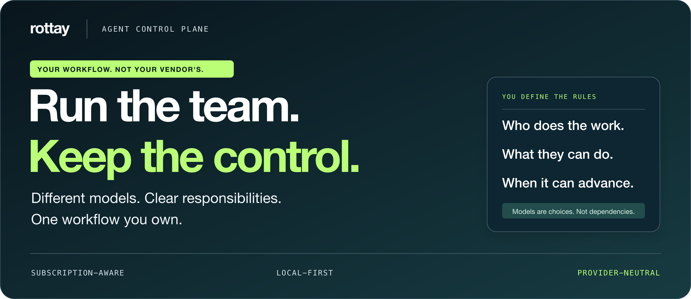
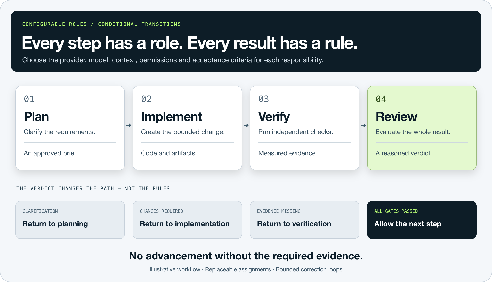
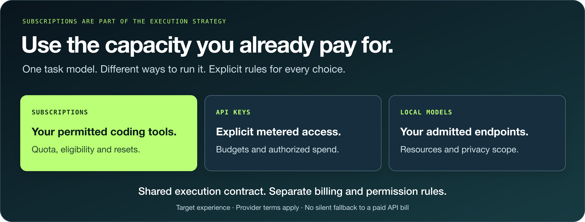
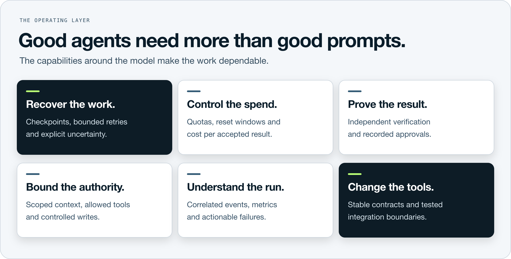

<!-- Canonical operational authority: docs/ROADMAP.md. -->
<h1 align="center">
  
</h1>

<p align="center">
  <a href="#one-workflow-different-responsibilities">Workflows</a> ·
  <a href="#put-your-subscriptions-to-work">Subscriptions</a> ·
  <a href="#control-what-happens-when-things-go-wrong">Reliability</a> ·
  <a href="#choose-the-tools-not-the-lock-in">Ecosystem</a> ·
  <a href="#what-you-can-build">Use cases</a> ·
  <a href="#inside-the-architecture">Architecture</a>
</p>

## Your AI team, from the first brief to a verified result.

Agent Control Plane is a local-first framework for coordinating work across AI
providers, models and accounts. Assign one agent to plan, another to implement,
another to test and another to review. Define what each must deliver — and what
must happen before the work moves forward.

**The goal: less manual coordination, better use of the capacity you pay for,
and the freedom to change providers without rebuilding your workflow.**

> This is the product we are building. Capabilities below describe the target
> experience; named alternatives require an implemented, verified adapter before use.
> [Read the product specification](docs/audit/README.md).

### The hard part is not opening another agent. It is keeping the work coherent.

A strong coding model can still run out of quota halfway through a change. A
reviewer can receive the wrong context. Two useful agents can overwrite the same
files. A successful-looking conversation can end without a single independent
check. Adding more models does not, by itself, solve those coordination problems.

Agent Control Plane brings the missing decisions into one operating model:

| What you want to control | What should no longer depend on remembering a chat |
|---|---|
| **The team** | Who owns each responsibility, with which model and account |
| **The boundaries** | What an agent may read, change, call or spend |
| **The handoff** | Which result and evidence the next worker receives |
| **The outcome** | Which conditions authorize completion, correction or escalation |
| **The continuity** | How the task waits, recovers or moves to a compatible worker |

This is the distinction between **running several agents** and **operating an
agent team**. The product is designed for the second.

---

## One workflow. Different responsibilities.

### Choose who does the work — and who decides it is good enough.

[Kimi](https://www.kimi.com/) could clarify requirements,
[Claude Code](https://code.claude.com/docs/en/overview) implement,
a separate worker verify the tests, and [Codex](https://openai.com/codex/) audit
the result. These are example assignments, not fixed rankings. Provider, model
and account are configurable for each step.



A review is not just a “next” button. Missing requirements return to planning;
defects return to implementation; missing evidence returns to verification.
Advancing requires the configured checks and approvals, not an agent saying “done.”

Independent work can run in parallel. Dependencies, account capacity and write
ownership determine what is safe to start together. Correction loops are bounded,
with an explicit path to pause or ask for help.

### An example: “Add downloadable reports to this application.”

The request sounds small. Delivering it involves product decisions, code, tests,
access rules and review. Instead of asking one conversation to do everything,
you define the responsibilities and the evidence they exchange.

*Illustrative workflow, not a fixed template or an assertion of current end-to-end support.*

| Responsibility | Example assignment | What it must deliver |
|---|---|---|
| **Clarify the request** | Kimi as coordinator | File format, selected data, access rules and acceptance criteria; unresolved decisions go to the operator |
| **Implement the feature** | Claude as implementer | A change inside an approved write-set, with artifact references and an explanation of behavior |
| **Verify the behavior** | A separate worker with a suitable model | Tests for normal output, empty results and unauthorized access, with actual command results |
| **Audit the change** | Codex or another independent reviewer | Findings against the agreed requirements and the exact change, not a restatement of the writer's summary |
| **Authorize the next action** | The configured policy and operator approval where required | Permission to advance or create a commit only after the required evidence is present |

Suppose the reviewer finds that the export includes data the requester cannot
access. **The plan does not advance because most tests passed.** It returns the
finding to implementation, invalidates evidence that no longer matches the
revised change, and requires the relevant checks again.

If the access rule was never defined, the correct next step is different: return
to clarification. If the implementation is correct but the test is missing,
send the work to verification. You configure these paths; the model does not
invent its own authority to skip them.

> **The next state is a decision backed by evidence — not the next message in a chat.**

### Configure the responsibility, not just the model name.

| Setting | What you define |
|---|---|
| Responsibility | Coordinate, investigate, implement, verify, audit or consult |
| Assignment | Provider, model/version, transport and eligible account |
| Context | Instructions, reference artifacts, scope and prior decisions |
| Permissions | Allowed tools, read/write boundaries and required approvals |
| Deliverable | A change, tests, findings or another result with acceptance criteria |
| Transition | Continue, request corrections, wait, escalate or stop |
| Resources | Budget, timeout, retry limits and concurrency |

Plans and assignments are versioned. Approvals refer to a specific revision.
A dry-run explains dependencies, capability requirements and estimated consumption
before execution. Editing preferences does not silently reassign in-flight work.

[Planning and team requirements](docs/audit/requirements/index.md#2-a--iniciativas-y-planificación) ·
[Execution contracts](docs/audit/architecture/contracts/index.md)

---

## Put your subscriptions to work.

### Coordinate the capacity you already pay for.



Subscription-based coding tools are a primary use case. The control plane is
designed to consider account eligibility, reported usage, reservations and reset
windows when assigning work — alongside API-key clients and local models.

| Execution path | What it brings |
|---|---|
| **Subscription** | Use a provider's permitted coding interface and manage its reported capacity |
| **API key** | Use explicit metered billing with an authorized budget |
| **Local or self-hosted** | Use an admitted endpoint under its resource and privacy constraints |

The execution contract is shared. Billing rules and permissions are not.

- **Choose deliberately.** Match role requirements to model capability and eligible capacity.
- **Wait or hand off safely.** Resume after renewal, or continue from a verified checkpoint on an authorized, compatible destination.
- **Measure the whole result.** Count retries, failed attempts and reviewers — not only the final response.

No hidden fallback to a paid API bill. No invented quota. Measured, estimated
and unknown consumption stay distinct; subscription allocation and API charges
are accounted for separately.

### An exhausted account should not erase a productive afternoon.

Consider a feature whose implementation pauses at a quota limit. An independent
documentation review may still be eligible to run; tests that depend on unfinished
code are not. The coordinator should know the difference instead of freezing the
entire initiative or launching every worker again.

For the paused task, the policy can wait for the reported renewal window or choose
a permitted compatible destination. The handoff includes the objective, accepted
decisions, last verified step, pending work and artifact references. It does not
copy an unlimited transcript and hope the next model interprets it correctly.

**Continuity is the objective; account switching is only one possible mechanism.**
If a destination lacks the required capability, needs operator authentication or
would exceed the budget, the correct state is an explained wait — not a hidden
downgrade or an unexpected invoice.

### The cheapest response is not always the cheapest result.

A low-cost model that needs repeated corrections can cost more than a stronger
model that produces an accepted result sooner. Conversely, an expensive model
need not perform every mechanical check. Routing should consider the responsibility,
quality evidence, latency and total consumption together.

Evaluations inform explicit, versioned policy changes. A new model can earn a
role through measured results rather than a permanent preference hardcoded into
the system. Usage remains attributable to the initiative and step, including
the cost of retries, verification and auditing.

<details>
<summary><strong>Account switching, savings and provider terms</strong></summary>

A handoff preserves task identity and bounded context, not a promise that native
conversation history transfers between providers. It revalidates the destination,
permissions and checkpoint before continuing.

Savings depend on workload, limits and review overhead. They must be measured;
a subscription is neither unlimited capacity nor an unrestricted API key.
Account switching must respect provider terms and cannot be used to bypass restrictions.
Authentication may require the operator.

For example, [Claude Code's provider policy](https://code.claude.com/docs/en/legal-and-compliance)
distinguishes individual subscription use from third-party products offering
Claude.ai login or routing subscription credentials on users' behalf. Commercial
integrations must use a permitted authentication and billing path.

[Accounts, quotas and economics](docs/audit/requirements/index.md#5-d--cuentas-y-economía)

</details>

---

## Control what happens when things go wrong.

### Long-running work needs more than a prompt and a terminal.



| Situation | The designed response |
|---|---|
| **A process crashes** | Recover task identity and checkpoints; reconcile uncertain effects before retrying |
| **A provider stops responding** | Apply bounded timeouts and retries; wait or use an explicitly permitted alternative |
| **An account runs out of capacity** | Pause or hand off under policy, without losing the task or hiding new charges |
| **A task needs outside input** | Wait for an approval, signal or timer supported by the selected driver |
| **Two agents want the same resource** | Reserve capacity and enforce write ownership before dispatch |
| **A check or review fails** | Record the evidence and follow the configured correction or escalation path |

Durable queues, cancellation, reattachment and concurrency belong to the execution
contract. Each driver declares what it can actually support. A simpler local
runtime must reject unsupported operations, not imitate stronger guarantees.

### Recovery must preserve meaning, not just restart a process.

Imagine an agent wrote a file and the supervisor crashed before recording the
outcome. Blindly repeating the request could create a duplicate effect or spend
quota twice. Recovery needs to reconcile what happened, preserve ownership and
decide whether continuation is safe.

The architecture therefore separates task state, attempts, effects, checkpoints
and evidence. **A durable engine cannot make every external side effect
exactly-once by itself.** Uncertain outcomes need explicit handling, including a
pause for inspection when the system cannot safely determine what occurred.

Cancellation follows the same principle. “Stop” is a lifecycle action with a
recorded outcome and preserved checkpoint, not a promise that killing a terminal
undoes changes already made.

### See the work, not just the last message.

Observability connects **the instruction, routing decision, attempts, effects,
result and verification**. That history should answer practical questions:

- What is running, waiting or blocked — and why?
- Which worker changed what, under which permissions?
- Where did the time and quota go?
- Which checks actually ran, and who accepted the result?

Live events, correlated logs, metrics and reconnectable streams provide the
operational view. Sensitive prompts and responses stay in access-controlled
artifacts, not ordinary browser streams or traces.

Telemetry remains optional: an unavailable tracing backend must not stop the
work or become another source of authority.

**For the operator:** a timeline should distinguish useful execution from waiting,
quota pressure, a pending approval or a disconnected stream. Notifications should
surface an actionable change, not repeatedly announce that nothing changed.

**For the developer:** correlated identifiers connect a task to its attempts,
tool effects, routing policy and verification. That makes it possible to diagnose
why one task needed several retries, or why the apparently fastest model produced
the most expensive accepted result.

[Observability requirements](docs/audit/requirements/index.md#7-f--trazabilidad-y-observabilidad) ·
[Recovery and data integrity](docs/audit/architecture/database/index.md)

---

## Choose the tools, not the lock-in.

### Stable responsibilities. Replaceable implementations.

Agent Control Plane does not replace every framework in the ecosystem. It
provides the contracts around them: task identity, permissions, budgets, evidence
and rules for how they cooperate.

The map below distinguishes the principal direction from alternative and optional
integration targets. **It is not a list of installed or currently supported plugins.**

| Responsibility | Technologies and integration direction |
|---|---|
| **Model execution** | [Claude Code](https://code.claude.com/docs/en/overview), [Codex](https://openai.com/codex/), [Kimi](https://www.kimi.com/); API-key and local-model adapters |
| **Durable orchestration** | [Restate](https://docs.restate.dev/) as the principal integration direction; [Temporal](https://docs.temporal.io/) as an alternative driver target; local [SQLite](https://sqlite.org/) supervisor |
| **Agent workflows** | Native harness; optional [LangGraph](https://docs.langchain.com/oss/python/langgraph/overview) and [LangChain](https://docs.langchain.com/oss/python/langchain/overview) adapters |
| **Tools and delegation** | [MCP](https://modelcontextprotocol.io/) and native tools; [A2A](https://a2a-protocol.org/latest/) as an external-agent extension |
| **Context and retrieval** | Scoped artifacts; optional [LlamaIndex](https://github.com/run-llama/llama_index), retrieval and vector-store adapters |
| **Observability** | [OpenTelemetry](https://opentelemetry.io/) / [OpenInference](https://github.com/Arize-ai/openinference); [Phoenix](https://arize.com/docs/phoenix) as the initial optional backend |
| **Evaluations** | [Promptfoo](https://www.promptfoo.dev/docs/intro/) and compatible runners informing one capability registry and versioned routing policies |
| **Storage and credentials** | [SQLite](https://sqlite.org/) and local artifacts; transactional database, object-store and keychain adapter targets |
| **Operator interaction** | CLI and API; a separately designed console, notifications and optional voice/realtime extensions |

### Combine capabilities without duplicating control.

A durable engine such as Restate or Temporal can own recovery for a run.
LangGraph can execute a bounded subtask inside it. MCP supplies tools;
OpenTelemetry and Phoenix observe. Each has a different job.

Preflight must reject competing owners, duplicate retry loops and hidden
fallbacks. Multiple engines can serve different scopes; they do not both control
the same execution.

### Where the familiar frameworks fit

**Restate and Temporal address durable execution.** They provide mechanisms for
long-running work to wait and recover. The control plane's driver contract owns
the semantics the product needs; a provider-specific SDK stays behind that
boundary. Supporting another engine means implementing and testing that contract,
not scattering engine-specific branches through the application.

**LangGraph and LangChain address work inside an agent workflow.** They can be
useful for a bounded reasoning graph, tool loop or specialized component. That
does not give the nested framework permission to choose a different billing
account, expand a write-set or start an unaccounted retry loop. The surrounding
task keeps its identity, budget and authority.

**MCP and A2A address different connections.** MCP is a tool integration boundary;
A2A is an extension direction for communicating with external agents. Neither
replaces the product's authorization and evidence model. A discovered tool still
needs permission to run, and an external agent's response still needs validation.

**OpenTelemetry, OpenInference and Phoenix address visibility.** Their job is to
carry and inspect operational evidence. **Promptfoo addresses evaluations:**
measured comparisons that can inform model selection and routing policy. Neither
observability nor evaluation results silently rewrite execution authority.

The benefit is practical: you can use a proven tool for its strengths without
letting it become the owner of every other concern in the system.

<details>
<summary><strong>What “provider-neutral” means in practice</strong></summary>

The domain owns its contracts. Adapters translate external protocols without
leaking vendor SDK types into shared models.

Selection, checkpoint continuation and live migration are separate capabilities.
Two tools exposing similar APIs does not make them interchangeable: each supported
profile must pass the corresponding behavioral tests.

Optional integrations are tested enabled, absent and unavailable. Install what a
use case needs; neither an external harness nor a telemetry service should be a
hidden prerequisite for the native path.

[Integration contracts](docs/audit/architecture/integrations/index.md) ·
[Composition and conflict rules](docs/audit/architecture/integrations/composition/index.md) ·
[Ecosystem comparison](docs/audit/architecture/integrations/market/index.md)

</details>

---

## What you can build

| Use case | The outcome to coordinate |
|---|---|
| **Feature delivery** | Brief, implementation, tests and independent review, with explicit approval gates |
| **Codebase audit or refactor** | Read-only investigation, evidence, bounded changes and verification against the original objective |
| **Parallel initiatives** | Separate plans, context and results sharing eligible capacity safely |
| **Long-running development** | Continuity across quota pauses, process restarts and compatible worker handoffs |
| **Model evaluation** | Compare quality, latency and total cost per accepted result before revising routing policy |

### Two initiatives, without two disconnected operating models.

One team could be developing a new backend module while another investigates a
frontend regression. Each initiative keeps its own plan, context, approvals and
results. Eligible account capacity can be shared, but permissions and artifacts
do not become interchangeable merely because the same provider executes both.

Read-only investigations can proceed together. Work that depends on a shared
contract waits for the dependency and its required checks. The point of
parallelization is **more completed work without competing ownership**, not simply
more open terminals.

### More interfaces, without a second set of rules.

The same task should be operable through CLI, API and a separately designed
console. Optional notification, voice or realtime adapters can extend how an
operator communicates with the system; they must still use the same permissions,
task identity and approval rules. An interface is a way to operate the product,
not an alternative authority over it.

The [full use-case catalog](docs/audit/requirements/index.md) covers planning,
execution, accounts, recovery, observability, security, installation and
extensibility. Every requirement has an owner, a contract and an acceptance test.

---

## Inside the architecture

### Explicit boundaries. Traceable data. Testable behavior.

The design separates domain rules from execution drivers, model providers,
tools, storage and operator interfaces. Interfaces and enums belong to their
owning concept; reusable behavior has one implementation.

Normalized operational models give initiatives, steps, attempts, accounts and
reservations explicit identities. A durable ledger records authoritative history;
engine journals, telemetry and rebuildable read models serve different purposes.

Certification focuses on behavior: instruction delivery, independent verification,
crash recovery, concurrent reservations, quota pressure, stream reconnection and
tool failures. Tests mirror module ownership outside production folders.

| Architectural commitment | What it protects |
|---|---|
| **One owner per concept** | No competing definitions of an account, task, permission or capability |
| **Explicit module boundaries** | Folder/index entry points, meaningful paths and dependencies that can be inspected |
| **Normalized data and migrations** | Consistent identities and relationships instead of opaque provider payloads as the product model |
| **Versioned policy and approvals** | An explanation of which rules and exact revision governed a result |
| **Conformance beyond types** | An adapter must deliver real instructions, cancellation, results and usage under its declared support profile |
| **Failure-path certification** | Recovery, isolation and optional-service failures tested as behavior, not inferred from interfaces |

The local ledger remains the record of product events. A workflow engine may
keep its own journal; a telemetry system may keep traces; a retrieval service may
keep an index. Those stores have distinct responsibilities. Changing one must not
silently replace the product's definition of a completed task or an authorized action.

<details>
<summary><strong>Technology foundation</strong></summary>

| Layer | Current implementation technologies |
|---|---|
| Language and contracts | [TypeScript](https://www.typescriptlang.org/), [Node.js](https://nodejs.org/), [Zod](https://zod.dev/) |
| Workspace and API | [pnpm](https://pnpm.io/), [Fastify](https://fastify.dev/) |
| Persistence and execution | [SQLite](https://sqlite.org/) with WAL, [better-sqlite3](https://github.com/WiseLibs/better-sqlite3), [Restate TypeScript SDK](https://docs.restate.dev/) |
| Console foundation | [React](https://react.dev/), [Vite](https://vite.dev/), [TanStack Query](https://tanstack.com/query), [Radix](https://www.radix-ui.com/), [XYFlow](https://xyflow.com/) |
| Verification | [Vitest](https://vitest.dev/), [ESLint](https://eslint.org/), TypeScript checks, [axe-core](https://github.com/dequelabs/axe-core), [GitHub Actions](https://github.com/features/actions) |

The console is a separate design effort, not an already-finished dashboard.
CLI, API and console are intended to share task semantics and authorization.
Replaceability applies to deliberate ports, not every library in the dependency tree.

</details>

<details>
<summary><strong>Developer setup and operational boundaries</strong></summary>

Requires Node.js 22.17.0 and pnpm 10.26.2.

```sh
pnpm install
git config core.hooksPath .githooks
node scripts/acquire-restate-server.mjs
pnpm check
```

The current Restate server pin supports macOS on Apple Silicon. Check the
[runbook](docs/operations/runbook.md) and [CI workflow](.github/workflows/ci.yml)
for platform-specific coverage. Scripted test fixtures do not consume provider
subscriptions or API calls.

The current surfaces are local-only and have **no product cutover authority**.
Adoption and wider exposure require separate validation and authorization.
Account configuration stays outside repositories at
`~/.rottay-agent-control-plane/accounts.local.json` (mode `0600`); protected
history carries credential references, not secrets. See [Security](SECURITY.md).

</details>

---

## Explore

| Product | Engineering | Development |
|---|---|---|
| [Use-case catalog](docs/audit/requirements/index.md) | [Architecture](docs/audit/architecture/index.md) | [Runbook](docs/operations/runbook.md) |
| [Specification](docs/audit/README.md) | [Data model](docs/audit/architecture/database/index.md) | [API reference](docs/api-reference.md) |
| [Ecosystem comparison](docs/audit/architecture/integrations/market/index.md) | [Testing strategy](docs/audit/quality/testing/index.md) | [Contributing](CONTRIBUTING.md) |
| [Interaction model](docs/audit/architecture/contracts/interaction/index.md) | [Integration contracts](docs/audit/architecture/integrations/index.md) | [Security](SECURITY.md) · [License](LICENSE) |

<p align="center">
  <strong>Your workflow should outlast your choice of tools.</strong><br>
  A project by <a href="https://github.com/rottay">Rottay</a>
</p>
