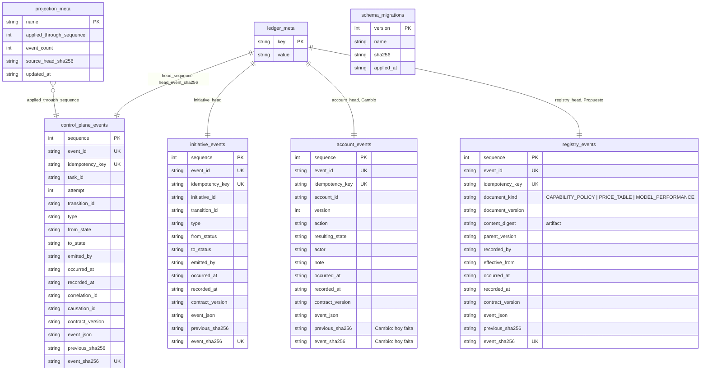
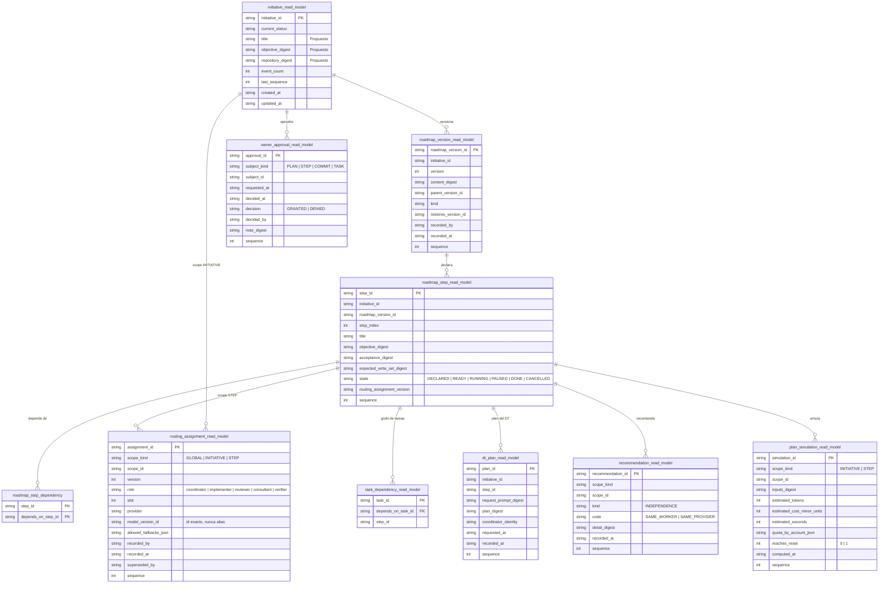
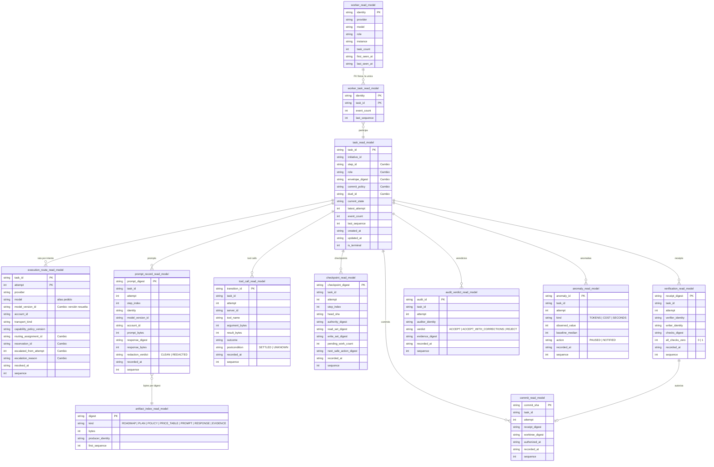
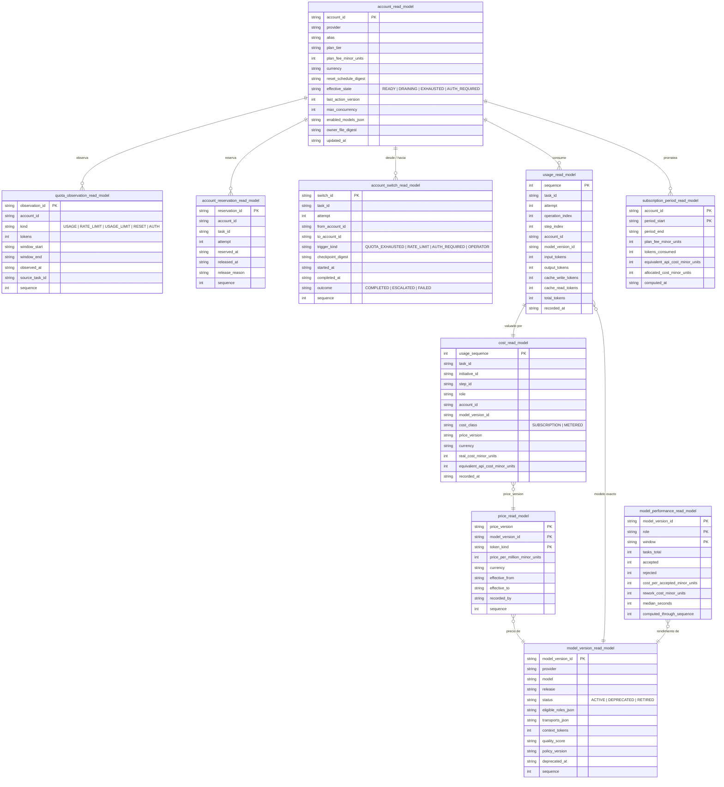
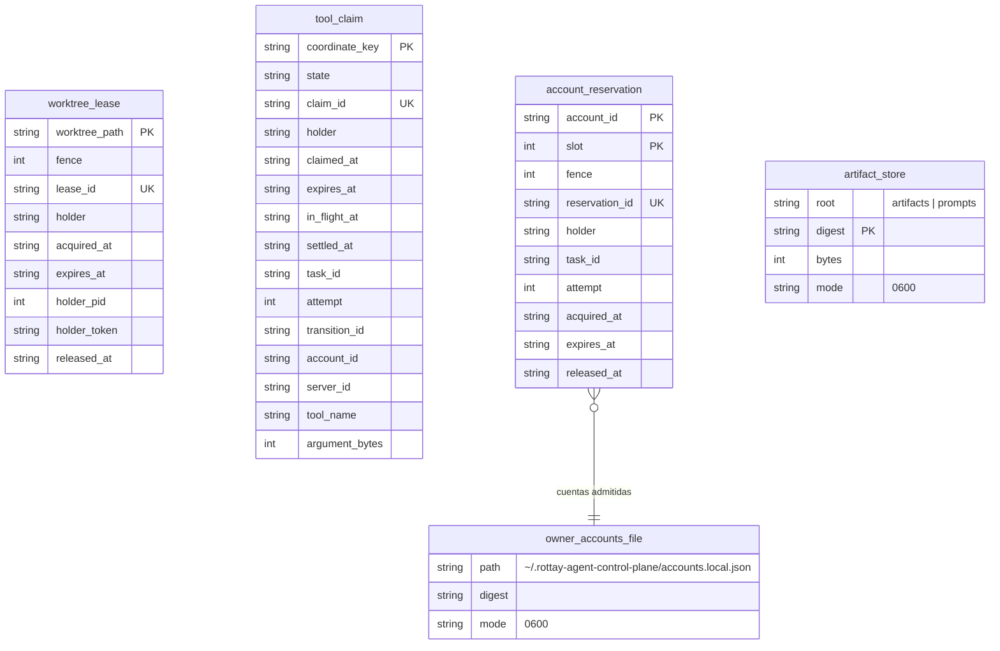

# DER objetivo del ledger y sus stores

Fecha: 2026-09-04. Base: el schema real en HEAD `4569478` (seis migraciones del
ledger, dos stores de arbitraje, un artifact store) más los casos de uso de
`use-cases.md`. Cada entidad lleva estado: **Hoy** existe tal cual, **Cambio**
existe y gana columnas, **Propuesto** es nueva. Las referencias `A11`, `D13`,
etc. apuntan al catálogo de casos de uso.

## Cómo se lee este DER

Este no es un modelo relacional clásico, y dibujarlo como tal mentiría. Hay
cuatro clases de objeto, y la clase decide las reglas:

| Clase | Qué es | Regla |
| --- | --- | --- |
| Stream | Tabla append-only, encadenada por hash, con triggers que abortan UPDATE y DELETE | Es la única verdad. Un hecho existe si está acá. |
| Read model | Tabla derivada por proyección desde un stream | Se reconstruye byte a byte desde los eventos. Se puede borrar y regenerar. No tiene FKs físicas entre sí, salvo una; la integridad referencial la da la cadena de eventos. |
| Arbiter store | Archivo SQLite aparte, sin historia, con fence monotónico | Decide vivacidad (quién tiene el lease, quién tiene la reserva). Perderlo cuesta vivacidad, nunca evidencia. |
| Artifact | Bytes en el filesystem, content-addressed por sha256, 0700/0600, rename atómico, sin delete | El ledger guarda sólo el digest. Prompts, respuestas, documentos de plan y políticas viven acá. |

Los documentos del owner (archivo de cuentas, tabla de precios, política de
capacidades) viven fuera de la base y entran al ledger por digest, como una
versión registrada.

Archivos físicos:

```
<data-root>/
├── acp.sqlite3                streams + read models + meta   (WAL)
├── tool-claims.sqlite         arbiter: tool_claim
├── worktree-leases.sqlite     arbiter: worktree_lease
├── account-reservations.sqlite   arbiter: account_reservation      [Propuesto]
└── artifacts/                 content-addressed, <2 hex>/<sha256>
    ├── artifacts/             roadmaps, planes, políticas, evidencia
    └── prompts/               prompts y respuestas                   [Propuesto]
```

---

## 1. Streams y meta



| Entidad | Estado | Cambio o propósito | Casos |
| --- | --- | --- | --- |
| `control_plane_events` | Hoy | Stream de tareas. Gana tipos de evento, no columnas: `PROMPT_RECORDED`, `RESPONSE_RECORDED`, `EXECUTION_EXPOSURE_RECORDED`, `ACCOUNT_RESERVED`, `ACCOUNT_RELEASED`, `QUOTA_PRESSURE_OBSERVED`, `OWNER_APPROVAL_REQUESTED`, `OWNER_APPROVAL_DECIDED`, `RETRY_ESCALATED`, `ANOMALY_DETECTED`, `TIME_LIMIT_REACHED`. | B5, B11, B15, B16, D4, D7, D13, D18 |
| `initiative_events` | Hoy | Stream de iniciativas. Gana: `ROADMAP_STEP_DECLARED`, `STEP_STATE_CHANGED`, `ROUTING_ASSIGNMENT_RECORDED`, `TASK_GRAPH_PLANNED`, `DT_PLAN_REQUESTED`, `DT_PLAN_RECORDED`, `PLAN_SIMULATED`, `RECOMMENDATION_RECORDED`, `MODEL_DUEL_DECLARED`. | A1, A3, A5, A6, A8, A11, A14, A15, B17 |
| `account_events` | Cambio | Acciones del operador sobre cuentas. Hoy sin cadena de hashes y fuera de `verifyIntegrity`; gana `previous_sha256` y `event_sha256`. Acciones nuevas: `PLAN_DECLARED` (tier, cuota mensual, moneda, cadencia de reset) y `LIMIT_DECLARED`. | D1, D6, D13 |
| `registry_events` | Propuesto | Versiones de documentos globales: política de capacidades, tabla de precios, snapshots de desempeño. Hoy la política vive en un JSON pineado por el fence; acá cada versión es un hecho con digest, autor y vigencia. | E4, E9, D12 |
| `ledger_meta` | Cambio | Gana `ledger_instance_id` (uuid al crear) para que la identidad del ledger no sea un digest del path. | H5 |
| `projection_meta` | Hoy | Marca hasta qué secuencia está aplicada cada proyección. Gana una fila por read model nuevo. | |
| `schema_migrations` | Hoy | Migraciones con checksum. | |

---

## 2. Planificación

Proyecciones del stream de iniciativas. Un roadmap sigue siendo un documento
versionado; lo nuevo es que sus pasos, equipos y dependencias son filas
derivadas y consultables.



| Entidad | Estado | Propósito | Casos |
| --- | --- | --- | --- |
| `initiative_read_model` | Cambio | Gana título, objetivo y repositorio por digest, que hoy no se proyectan. | A1, A9 |
| `roadmap_version_read_model` | Hoy | Sin cambios. | A2, A10 |
| `roadmap_step_read_model` | Propuesto | Un paso del roadmap como fila: índice, objetivo, aceptación, write-set esperado, estado y qué versión de asignación de modelos lo gobierna. | A3, A8 |
| `roadmap_step_dependency` | Propuesto | Orden entre pasos. | A3 |
| `routing_assignment_read_model` | Propuesto | Qué modelo y versión exacta hace cada rol, en tres scopes con precedencia STEP sobre INITIATIVE sobre GLOBAL. Cada edición es una versión nueva; `superseded_by` cierra la anterior. La validación fail-closed cruza `model_version_id` contra `model_version_read_model`. | A4, A11, A12, A13 |
| `task_dependency_read_model` | Propuesto | El grafo de tareas de un paso. El scheduler lo lee además del conflict graph. | A5 |
| `dt_plan_read_model` | Propuesto | Pedido y plan del coordinador, ambos por digest. | A6 |
| `owner_approval_read_model` | Propuesto | Compuertas del owner sobre plan, paso, commit o tarea; la decisión reanuda por señal durable. | A7 |
| `recommendation_read_model` | Propuesto | Recomendaciones que no bloquean, hoy sólo la de independencia del equipo. | A14 |
| `plan_simulation_read_model` | Propuesto | Estimaciones registradas para compararlas después con el costo real. | A15, D14 |

---

## 3. Ejecución y trazabilidad

Proyecciones del stream de tareas. Acá vive la cadena completa: worker, cuenta,
modelo, prompt, respuesta, herramientas, uso, verificación, commit, receipt.



| Entidad | Estado | Propósito | Casos |
| --- | --- | --- | --- |
| `task_read_model` | Cambio | Gana paso, rol, digest del envelope, política de commit y `duel_id`. | B1, B13, B17 |
| `execution_route_read_model` | Cambio | Gana la versión resuelta del modelo, qué asignación la decidió, la reserva de cuenta y la escalera de reintento. | A11, B2, B14, B16, D7 |
| `prompt_record_read_model` | Propuesto | Cada prompt y su respuesta por digest; los bytes en `artifacts/prompts/`. Nunca texto en el ledger. | B5, B15, F1, F2 |
| `tool_call_read_model` | Propuesto | Proyección de los receipts durables de tools, que hoy se pliegan al vuelo en la ruta. | B7 |
| `checkpoint_read_model` | Propuesto | El checkpoint como fila; hoy el schema existe y nadie lo produce. | B9, D5 |
| `verification_read_model` | Propuesto | El receipt del verificador con identidad de writer y verificador; la regla verificador distinto del writer se verifica acá. | C1, C3 |
| `audit_verdict_read_model` | Propuesto | Veredicto y evidencia del auditor. | C2 |
| `commit_read_model` | Propuesto | Commit autorizado con su receipt y sha real. | C3 |
| `worker_read_model`, `worker_task_read_model` | Hoy | Sin cambios. | F8 |
| `artifact_index_read_model` | Propuesto | Índice de lo que hay en el artifact store, por clase, para consola y retención. | F2 |
| `anomaly_read_model` | Propuesto | Tareas pausadas por consumo fuera de la mediana. | D18 |

---

## 4. Economía: cuentas, cuota, uso y costo

Proyecciones del stream de tareas (uso, costo, reservas, switches, presión de
cuota), del stream de cuentas (estado efectivo, plan) y del registry (modelos,
precios, desempeño).



| Entidad | Estado | Propósito | Casos |
| --- | --- | --- | --- |
| `account_read_model` | Propuesto | Hoy las cuentas se sirven desde el archivo del owner más un fold de `account_events`, sin tabla. Acá el estado efectivo, el plan y su cuota mensual, el tope de concurrencia y el digest del archivo fuente. | D1, D6, D13 |
| `quota_observation_read_model` | Propuesto | Lo que el estimador de cuota necesita y hoy recibe vacío: uso por cuenta y señales del proveedor con ventana. | D2, D3, D4 |
| `account_reservation_read_model` | Propuesto | Reservas por walk, proyectadas desde `ACCOUNT_RESERVED` y `ACCOUNT_RELEASED`. | D7 |
| `account_switch_read_model` | Propuesto | Un switch como fila con su checkpoint y su desenlace; `completed_at` sólo cuando la sesión nueva existe. | D5 |
| `usage_read_model` | Propuesto | Uso por llamada con tokens por tipo y modelo exacto. Los rollups por tarea, paso, iniciativa, cuenta, rol y modelo son vistas sobre esta tabla. | D9, D11 |
| `cost_read_model` | Propuesto | Proyección pura sobre `usage_read_model` y `price_read_model`: una fila por fila de uso, con costo real, valor equivalente y la versión de precios vigente en ese momento. No hay evento de costo: el costo es función de dos hechos, y así el rebuild es determinista. | D13, D16 |
| `subscription_period_read_model` | Propuesto | Prorrateo de la cuota del plan por período y cuenta; base del retorno por suscripción. | D13, D15 |
| `model_version_read_model` | Propuesto | El registry de capacidades como proyección de `registry_events`, con ciclo de vida de la versión. Es lo que valida una asignación por paso. | A13, E4, E5 |
| `price_read_model` | Propuesto | Precio por tipo de token, modelo y versión, con vigencia. | D12 |
| `model_performance_read_model` | Propuesto | Aceptación, costo por tarea aceptada, rework y tiempo por modelo y rol; alimenta al registry y al duelo. | E9, B17, D16 |

---

## 5. Arbiter stores y filesystem



| Entidad | Estado | Propósito | Casos |
| --- | --- | --- | --- |
| `worktree_lease` | Hoy | Un lease por worktree con fence monotónico. Pendiente del audit: el grant commitea antes del evento `LEASE_ACQUIRED`. | B3, H3 |
| `tool_claim` | Hoy | Compare-and-set entre procesos por coordenada de tool call. | B7 |
| `account_reservation` | Propuesto | Mismo patrón que el lease, por cuenta y slot: dos walks no pueden tomar el último margen de la misma cuenta; el tope de concurrencia por cuenta es la cantidad de slots. | D7 |
| `artifact_store` | Cambio | Gana la raíz `prompts/` para bytes de prompts y respuestas, con el mismo contrato: 0700/0600, rename atómico, verificación de digest al leer, sin delete. | F2 |
| `owner_accounts_file` | Hoy | Fuera de todo repositorio. Gana por cuenta: tier, cuota mensual, moneda, cadencia de reset y tope de concurrencia; entra al ledger como `PLAN_DECLARED` con el digest del archivo. | D1, D13 |

---

## Invariantes que el DER tiene que sostener

1. Ningún byte de prompt, respuesta, argumento de tool ni credencial en ninguna tabla. Sólo digests, conteos y vocabulario cerrado.
2. Todo read model se borra y se reconstruye desde los streams con resultado byte-idéntico. Un read model que no pueda reconstruirse no es un read model, es un arbiter, y va en su propio archivo.
3. Los cuatro streams se verifican en `verifyIntegrity`; hoy son dos.
4. Una asignación de modelo por paso referencia un `model_version_id` que existe en `model_version_read_model` con estado `ACTIVE`; si no, la edición se rechaza con la razón.
5. Una fila de `cost_read_model` referencia la `price_version` vigente en el momento de la fila de uso; un cambio de precios crea filas nuevas, nunca reescribe.
6. Un `account_switch_read_model.completed_at` sólo existe si hay una `execution_route_read_model` posterior en la cuenta destino.
7. `ledger_instance_id` viaja en el frame `hello` del stream SSE; dos archivos distintos en el mismo path son dos ledgers.

## Orden de aterrizaje sugerido

1. `account_events` encadenado, `ledger_instance_id`, `appendBatch`.
2. `usage_read_model` con tokens por tipo y `prompt_record_read_model` con `artifacts/prompts/`; es la base de trazabilidad y de costo.
3. `registry_events` con `model_version_read_model` y `price_read_model`; luego `cost_read_model` y `subscription_period_read_model`.
4. `account_read_model`, `quota_observation_read_model`, `account_reservation` y su read model, `account_switch_read_model`.
5. `roadmap_step_read_model`, `routing_assignment_read_model`, `task_dependency_read_model`, `owner_approval_read_model`, `recommendation_read_model`.
6. `checkpoint`, `verification`, `audit_verdict`, `commit` como proyecciones de los beats que hoy son `PLAIN`.
7. `model_performance_read_model`, `plan_simulation_read_model`, `anomaly_read_model`.
